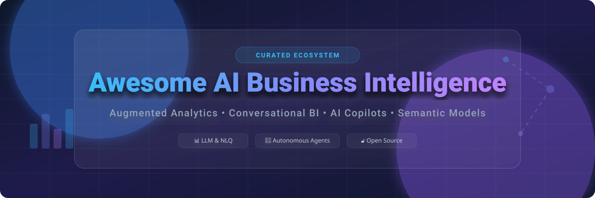

# Awesome-AI-Business-Intelligence 📊 🧠

  

  
  
  
  
  
  

---

## 🌟 Top AI Business Intelligence Ecosystem

**Curated List of Commercial AI BI Platforms & Open-Source Augmented Analytics Tools**  
*Focused on Natural Language Query, Automated Insights, Predictive Analytics, AI Copilots, Semantic Modeling & Self-Hosted BI*

**Last updated: October 2026** 📅

---

### 📌 Overview & SEO Summary
Welcome to the ultimate curated directory of **AI business intelligence platforms**, **open-source augmented analytics tools**, and **conversational BI frameworks**. Whether you are looking for enterprise-grade commercial solutions (such as *Tableau AI*, *Power BI Copilot*, and *ThoughtSpot Sage*), or self-hostable open-source alternatives (like *Apache Superset*, *Metabase*, and *Knowage*), this list covers category leaders, natural language query, and privacy-respecting analytics.

**Key Market Context:**
- **Power BI Copilot** requires **Fabric capacity** (F2 or higher) — **Pro or PPU licenses alone are insufficient** [citation:2]. **Region support is limited** — unavailable in West India, Central Indonesia, South Korea, and several other regions [citation:2].
- **Qlik AutoML** democratizes predictive analytics with **automated model creation and full explainability** for business users [citation:4].
- **Sisense Fusion AI** provides **embedded AI Chat, NLG Insights, and NLQ** through its Compose SDK, with **React component integration** [citation:6].
- **Tellius** (now **Kaiya**) supports **multi-model LLM backends (Gemini + OpenAI)** with **embedding into customer applications** and **smart deduplication for insights** [citation:7].

---

## 📑 Table of Contents
- [🏢 SaaS & Commercial Platforms](#-saas--commercial-platforms)
- [🔓 Open-Source GitHub Projects](#-open-source-github-projects)
- [🛠️ How to Contribute](#%EF%B8%8F-how-to-contribute)
- [📊 Star History](#-star-history)
- [🤝 Support & Sponsorship](#-support--sponsorship)
- [⚠️ Disclaimer](#%EF%B8%8F-disclaimer)

---

## 🏢 SaaS / Commercial Platforms

The AI business intelligence market spans **enterprise BI suites with AI copilots** (Tableau AI, Power BI Copilot, Looker Duet AI) that integrate **natural language query and automated insights into existing platforms**, **AI-native analytics platforms** (ThoughtSpot Sage, Tellius/Kaiya, Sisu) that were **built from the ground up for search-driven and automated analytics**, and **embedded analytics platforms** (Sisense Fusion, Domo AI) that focus on **embedding AI-powered insights into applications**. **Tableau AI** requires **Tableau+ with Salesforce and Data Cloud setup** [citation:1]. **Power BI Copilot** requires **Fabric capacity** — **Pro/PPU licenses alone are insufficient** [citation:2]. **Qlik AutoML** is **available to Qlik Cloud users** with **no additional licensing** for basic use [citation:4].

| SaaS / Commercial Platform | Company / Owner | Valuation / Market Cap | Standard Edition Starting Price | Free Tier / Free Trial Limits | Description |
| :--- | :--- | :--- | :--- | :--- | :--- |
| **[Tableau AI (Tableau+)](https://www.tableau.com/)** 📊 | Salesforce | ~$250 Billion | **Requires Tableau+** (custom pricing) | **No free tier**; trial available | **Enterprise BI with generative AI** — **Tableau Agent for natural language query and report generation** . **Requires Salesforce Einstein and Data Cloud setup** . **Tableau Pulse for automated insights** . **Available in Tableau Desktop, Prep, and Cloud** [citation:1][citation:13]. |
| **[Microsoft Power BI Copilot](https://powerbi.microsoft.com/)** 🔷 | Microsoft | ~$3.90 Trillion | **Requires Fabric capacity** (F2+: ~$262/month PAYG) | **No free tier for Copilot** | **Microsoft-native BI with AI** — **Natural language Q&A, report summaries, and DAX generation** . **Requires Fabric capacity** — **Pro/PPU licenses alone are insufficient** [citation:2]. **Limited regional availability** — not in West India, Central Indonesia, South Korea, and several others [citation:2]. |
| **[ThoughtSpot Sage](https://www.thoughtspot.com/)** 🔍 | ThoughtSpot | ~$4 Billion | **Custom enterprise pricing** | **Free trial available** | **Search-driven AI analytics** — **Natural language search with GPT integration** . **AI-generated answers with narratives** . **Data modeling with AI-created synonyms and descriptions** . **Embeddable in custom applications** [citation:3][citation:15]. |
| **[Qlik AutoML](https://www.qlik.com/)** 🟢 | Qlik | ~$3 Billion | **Custom enterprise pricing** | **Free trial available** | **Automated machine learning for BI** — **Create predictive models without data science expertise** . **Full explainability for business users** . **Integrates with OpenAI, Amazon Bedrock, Azure ML, and Databricks ML** [citation:4]. |
| **[Looker Duet AI](https://looker.com/)** 🔵 | Google (Alphabet) | ~$2.0 Trillion | **Custom enterprise pricing** | **Free trial available** | **Google-native BI with generative AI** — **Natural language query and report generation** . **Generates visualizations, dashboards, and narrative summaries** . **Built on LookML semantic model** for governance and accuracy [citation:5][citation:17]. |
| **[Sisense Fusion AI](https://www.sisense.com/)** 🟣 | Sisense | Private | **Custom enterprise pricing** | **Free trial available** | **Embedded analytics with AI** — **AI Chatbot, NLG Insights, NLQ, and query recommendations** . **Compose SDK with React components** . **Embeddable into applications** [citation:6][citation:18]. |
| **[Tellius / Kaiya](https://www.tellius.com/)** 🧠 | Tellius | Private | **Custom enterprise pricing** | **Free trial available** | **AI-native decision intelligence** — **Kaiya conversational analytics** . **Multi-model LLM support (Gemini + OpenAI)** . **Embeddable into customer applications** . **Smart deduplication for accurate insights** [citation:7]. |
| **[Domo AI](https://www.domo.com/)** 🟡 | Domo | ~$1 Billion | **Custom enterprise pricing** | **Free trial available** | **Business cloud with AI** — **AI Chat with @-mention context, multi-dataset analysis, and chart generation** . **AI Agents in Workflows** . **FileSets for unstructured data** . **Automated insights and metrics** [citation:8][citation:19]. |
| **[Sisu Data](https://sisu.ai/)** 📈 | Snowflake (Acquired) | ~$50 Billion (Snowflake) | **Custom enterprise pricing** | **No free tier** | **Decision intelligence engine** — **AI/ML-powered analysis of highly dimensional data** . **Surfaces relevant insights in seconds** . **Acquired by Snowflake in October 2023** [citation:9]. |
| **[Pyramid Analytics](https://www.pyramidanalytics.com/)** 🔺 | Pyramid Analytics | Private | **Custom enterprise pricing** | **Free trial available** | **Decision intelligence platform** — **AI-powered data prep, science, and analytics** . **Semantic models and business analytics** . **Natural language query and dashboards** [citation:10]. |

---

## 🔓 Open-Source GitHub Projects

*Sorted by GitHub_Stars_Count (Descending)* 🌟

- **[Apache Superset](https://github.com/apache/superset)**   
  **The most complete open-source BI platform**, Apache-2.0 licensed. **40+ chart types, full SQL editor, and broadest warehouse coverage** — native connectors for Snowflake, BigQuery, Databricks, Redshift, Postgres, MySQL, Trino, ClickHouse, and 40+ more via SQLAlchemy. **Semantic layer** built around datasets and reusable metrics. **dbt manifest integration**. **Embedded SDK included free** — server issues guest token with RLS rules. **Stateless web tier scales horizontally**.
